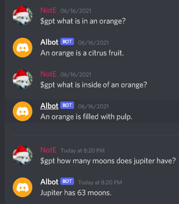

# OpenAI Discord Bot
I got access to the openAI beta, and at the time I was interested in creating some discord bots.  
So the nature course of action was to make a discord bot using the OpenAI API.  
I made a simple one that will answer questions the user can ask, and it is surprisingly capable. 
Its written in Python using the Discord.py library and the OpenAI python library.
Example Questions:  

